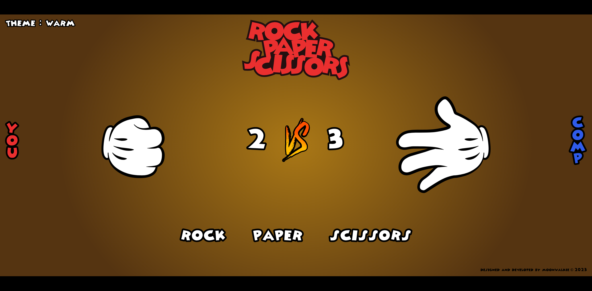

# Rock, Paper, Scissors

Live site: https://moonwalkie.github.io/rock-paper-scissors/

## Overview

Hop on and play an exciting (hopefully) game of rock, paper and scissors in the style of Mickey Mouse. Delve into your inner child and bring out your childhood joy with this simple but beautifully crafted game.

## Assets

All animations and illustrations are created by me and are a concept of mine. This game is not created for the purpose of making any profit or other commercial purposes.

This assignment is part of <a href="https://www.theodinproject.com/">The Odin Project</a> curriculum.